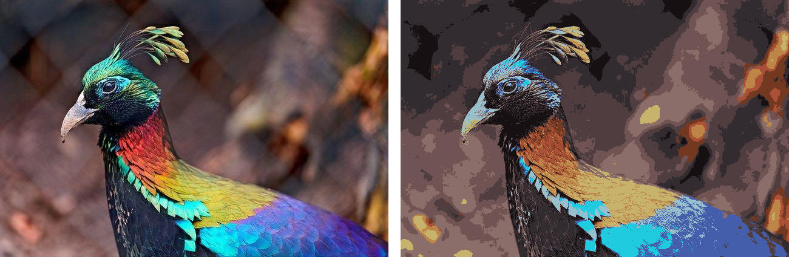

# Color quantizer with K-means clustering

In which I tried to write a generic multi-threaded K-means clustering
implementation in Rust.

## Usage

	imgquant <INPUT> <QLEVEL> <ITERATIONS> <OUTFILE>
